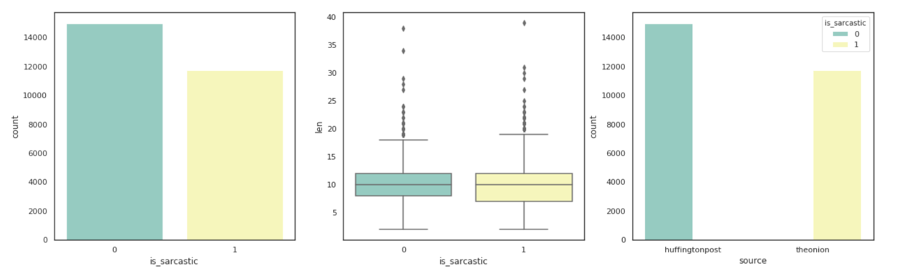
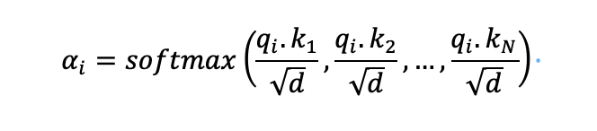

# Sarcasm Detection using News Headlines

## Introduction

The headline is a one-or two-line description of the contents of the media story in such a type that informs readers about the subject of the plot. Headlines are an index of the contents of the newspaper and a summary of its stories.

### The jupyter notebooks are used for:
* Assess if news headline is sufficient for sarcasm prediction.

* Assess significance of context on news headline sarcasm prediction.

* Identify if the news is sarcastic headline, using naïve bayes, word embedding, CNN, RNN, LSTM and BERT state-of-the-art model techniques.

* Compare the prediction statistics state of the art models.

# Data Set

The data set is a popular kaggle challenge data set on [News Headline](https://www.kaggle.com/rmisra/news-headlines-dataset-for-sarcasm-detection)

The News Headlines dataset for Sarcasm Detection is collected from two news website. TheOnion aims at producing sarcastic versions of current events. Real (and non-sarcastic) news headlines are collected from HuffPost.

This new dataset has following advantages over the existing Twitter datasets:

* Since news headlines are written by professionals in a formal manner, there are no spelling mistakes and informal usage. This reduces the sparsity and also increases the chance of finding pre-trained embeddings.

* Furthermore, since the sole purpose of TheOnion is to publish sarcastic news, we get high-quality labels with much less noise as compared to Twitter datasets.

* Unlike tweets which are replies to other tweets, the news headlines we obtained are self-contained. This would help us in teasing apart the real sarcastic elements.

Content
Each record consists of three attributes:

* is_sarcastic: 1 if the record is sarcastic otherwise 0

* headline: the headline of the news article

* article_link: link to the original news article. Useful in collecting supplementary data

High level analysis of data is as below picture.

# Models

For the study of sarcasm detection various STOA methods are explored.

## Base Model Analysis

The base model is created using spacy library fand the result is as below.

## Models Analysed:

* BERT
* LSTM
* Naïve Bayes
* Word embeddings with Word2Vec
* Word embeddings with Glove
* Word embeddings with Conv1D
* Word embeddings with Conv1D, GRU
* Word embeddings with Fully connected network
* Word embeddings with LSTM
* Word embeddings with Bi-LSTM

## BERT based Results
BERT is being built around a transformer (the attention mechanism that learns contextual relationships between words in a text). A decoder is a simple transformer that makes a function prediction and the encoder reads text data. Only the encoder component is needed because the goal of BERT is to create a language model. The BERT encoder receives a series of input tokens that are transformed into vectors before the neural network is processed. However, before BERT can start processing, the input must be massaged and embellished with a few extra metadata.

Bert is designed to pre-train deep bi-directional representations of unmarked text by jointly conditioning both the left and the right sentences in all layers, as opposed to the recent language model implemented in all layers (Peters et al., 2018a). As a result, the pre-trained BERT model can be finished with only one additional outgoing layer to create modern models for a variety of tasks, such as question response and language inference, without the need for major task-specific design changes

Out of all the methods available, BERT provied best results with least effort, as the pre-trained model alreay is capable of classifying the text best on sarcasm.

Below diagram shows the depiction of BERT layer classification.

<!--  -->
<!--  -->

The neuron view visualizes the individual neurons in the query and key vectors and shows how they interact to produce attention. Given a token selected by the user (left), this view traces the computation of attention from that token to the other tokens in the sequence (right). Note that the Transformer uses scaled dot-product attention, where the attention distribution at position i in a sequence x is defined as follows:

In the equation, q_i is the query vector for the token on which attention is paid, k_i  is the token which is receives the attention. q × k is the element wise product between the query and key vector, whereas q ⋅ k is the dot product between query and key vector, and Softmax is used to calculate the attention score.

Below diagram shows the computation made while predicting the target.

# References

Data Set: https://www.kaggle.com/rmisra/news-headlines-dataset-for-sarcasm-detection

theonion: https://www.theonion.com

huffingtonpost: https://www.huffingtonpost.com

BertViz: https://github.com/jessevig/bertviz

huggingface: https://github.com/huggingface/transformers

huggingface BERT: https://huggingface.co/transformers/model_doc/bert.html
